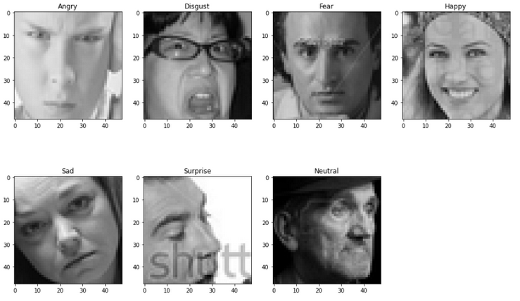

# Design and implementation of machine learning model(s) to detect emotions based on facial images

We trained a Decision Tree Classifier (DTC), Random
Forest Classifier (RFC), and a convolutional neural network
on 80 percent of a training set of 35,887 48x48 facial images from FER-20213 dataset [Kaggle](https://www.kaggle.com/datasets/msambare/fer2013). We used the remaining 20 percent to test and validate the results. We used a hyperparameter search to determine the best parameters for these models. As a result, the
convolutional neural network had a better accuracy score
(score=0.54) on test data compared to the other two classifiers. On the other hand, RFC had better performance than
DTC.

The data is classified into 7 emotion categories: angry,
disgusted, fearful, happy, neutral, sad, and surprised. Examples of each category of input data are shown in the Figure below:

